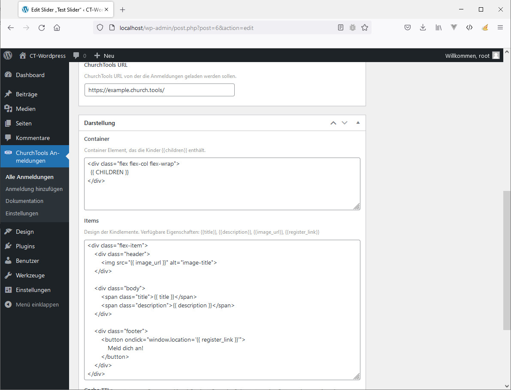

# Wordpress-Plugin ChurchTools Anmeldung

Dieses Git-Repo soll ein Proof of Concept vorlegen, wie ein mögliches Wordpress-Plugin für ChurchTools Anmeldungen aufgebaut sein könnte.

Wenn du Interesse hast, bei der Umsetzung des Plugins mitzuhelfen melde dich gern bei mir:

* Lukas Dumberger: lukas.dumberger@gmail.com; [GitHub](https://github.com/DumbergerL)
* [Beitrag im ChurchTools-Forum](https://forum.church.tools/topic/8130/wordpress-formular-mit-ct-verbinden/4)

## Problemstellung und Zielsetzung

Aktuell nutzen viele Webseiten ein IFrame um die ChurchTools-Anmeldungen auf ihrer Webseite einzubinden:

Das Problem ist, dass sich die Darstellung des IFrames nur in mancher Hinsicht anpassen lässt. Ziel ist deshalb eine Plugin für Wordpress zu konzipieren, dass die Daten direkt auf ChurchTools abruft und anschließend in einem eigenen/konfigurierten Format darstellt.

## Idee 1: "Template-Ansatz"

Idee: Die Daten werden vom Plugin aus ChurchTools direkt geladen. Für das Rendern auf der Seite wird eine Template Bibliothek verwendet. Der HTML-Code für die Darstellung auf der Seite wird mit Markern versehen die während dem Render-Prozess mit Daten befüllt werden. Beispiele für solche Marker könnten sein `{{ title }}` für den Titel der Anmeldung, `{{ image_url }}` für den Link zum Bild, etc.:

Für die Abfrage der Daten ist lediglich die Url zur ChurchTools installation notwendig und den "Link" der Gruppen-Homepage (GroupHomepage). Weiter Optionen wie Caching sind denkbar:

Die Einbindung auf einer Seite erfolgt mittels Short-Code:

**Bibliotheken:**

* [CT-Api Wrapper](https://github.com/5pm-HDH/churchtools-api) für den Datentransfer
* [Twig](https://twig.symfony.com/) als mögliche Template-Engine
